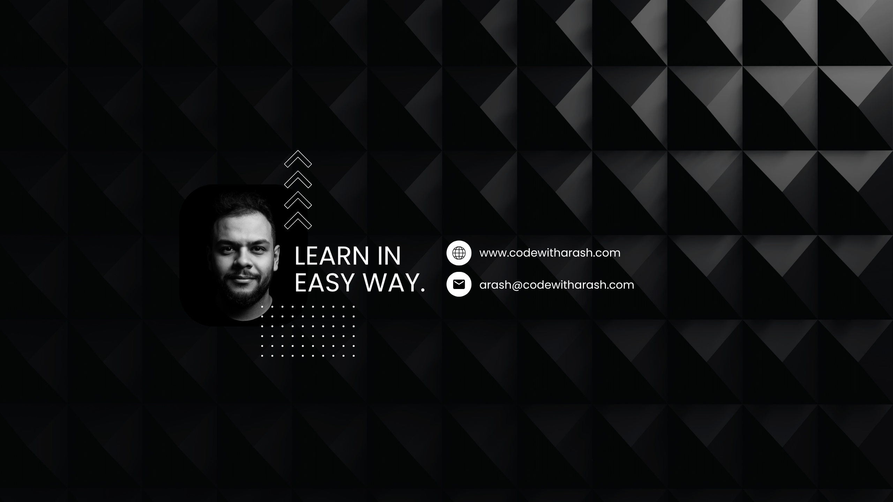

<!-- Hero -->

  

<h1 align="center">Hi, I'm Arash 👋</h1>

  Senior Software Developer / Team Lead • Java/Spring Boot • Cloud-native Microservices • React/Next.js

  
  
  
  

---

## About me

- 💻 Senior Software Developer / Team Lead building **scalable microservices** and **cloud-native systems** with **Java/Spring Boot**, plus modern UIs with **React/Next.js**
- 🔐 Strong focus on **secure-by-design** development (OAuth/JWT, Spring Security), and production reliability (CI/CD, containers)
- 🧠 I enjoy mentoring & teaching (Java, Spring, SQL, algorithms)
- 🚀 Building **CodeWithArash** on YouTube (tutorials + real-world projects)
- 🤝 Open to **remote roles**, **freelance/backend work**, and collaborations on impactful products

---

## Impact highlights

- ⚙️ Refactored a monolith into **30+ DDD-based microservices**
- 🚀 Improved PostgreSQL query performance by **~40%** (including JSONB optimization)
- 📣 Built high-throughput services handling **1B+ records** and **10K+ concurrent notifications**
- 🧑‍🏫 Delivered 15+ hours/week of training; mentored **60+** learners

---

## Tech stack

  

**Backend:** Spring Boot, Spring Cloud, Microservices, CQRS, Event Sourcing, SAGA, gRPC, REST, Kafka  
**Security:** OAuth2, JWT, API Gateway (Apache APISIX)  
**Data:** PostgreSQL, MongoDB, SQL performance tuning, JPA/Hibernate  
**Cloud/DevOps:** Docker, CI/CD (Jenkins), AWS, Cloud-native patterns  
**Frontend:** React, Next.js, Tailwind CSS (plus React Native for mobile)

---

## Featured project

### 🗣️ Langoosh — AI language learning platform
- Microservices backend with **Spring Boot + Spring Cloud**
- AI features: **TTS**, **STT**, and dynamic response generation
- Secure access with **Spring Security + JWT + RBAC**
- Designed UI in Figma; built mobile app with **React Native**

---

## GitHub stats

  

---

## Visitors & followers

  
  

